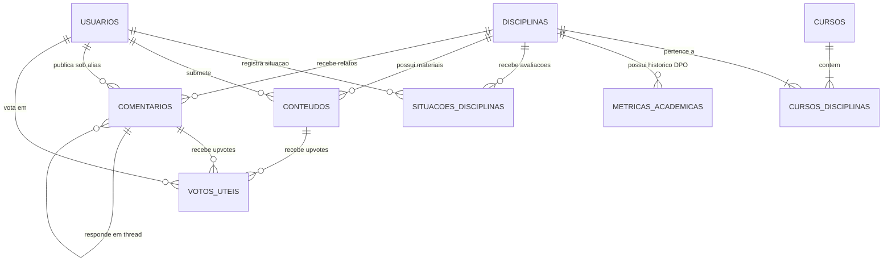

# 🏛️ Arquitetura e Decisões Técnicas

## 1. Arquitetura em Camadas do Backend

O backend foi estruturado seguindo os princípios de isolamento de responsabilidades e **Clean Architecture**, permitindo testabilidade unitária ágil em milissegundos sem dependência de um banco de dados ativo:

```
backend/app/
├── api/             # Routers HTTP do FastAPI e Schemas Pydantic (validação de entrada e saída)
├── core/            # Configurações globais (.env, Engine SQLAlchemy e segurança JWT)
├── domain/          # Lógica de negócio pura (cálculos de evasão, agregação de taxas, moderação)
├── services/        # Casos de uso e orquestração entre API e repositórios
├── repositories/    # Consultas SQL e persistência assíncrona via SQLAlchemy ORM
├── models/          # Entidades relacionais mapeadas com SQLAlchemy
└── pipeline/        # Ingestão ETL: extração DPO/INEP, normalização e carga
```

---

## 2. Diagrama Entidade-Relacionamento (DER)

Abaixo está a modelagem conceitual do banco de dados relacional:



---

## 3. Modelo Relacional de Dados (PostgreSQL 17)

O esquema relacional é composto pelas seguintes tabelas canônicas:

### Estrutura de Acesso e Usuários
* **`usuarios`**:
  * `id` (`UUID`, PK): Identificador único do usuário.
  * `nome` (`VARCHAR(100)`): Nome do usuário.
  * `email` (`VARCHAR(150)`, UNIQUE): E-mail de login.
  * `password_hash` (`VARCHAR(255)`): Senha criptografada (Argon2 / Bcrypt).
  * `role` (`VARCHAR(20)`): Papel no sistema (`STUDENT`, `MODERATOR`, `ADMIN`).
  * `is_active` (`BOOLEAN`): Indicador de conta ativa.
  * `created_at` (`TIMESTAMPTZ`): Data de cadastro.
  * *Observação:* Não são armazenados dados sensíveis como matrícula ou CPF.

### Estrutura Curricular e Institucional
* **`cursos`**: Metadados institucionais (`codigo_mec`, `nome`, `campus`, `grau`, `turno`, `slug`).
* **`disciplinas`**: Cadastro das matérias (`codigo`, `slug`, `nome`, `departamento`, `creditos`, `carga_horaria`, `ementa`).
* **`cursos_disciplinas`**: Matriz curricular associando matérias a semestres recomendados (`curso_id`, `disciplina_id`, `periodo_sugerido`, `is_obrigatoria`).

### Dados Analíticos e Métricas Históricas
* **`metricas_academicas`**: Fato analítico agregado com dados do DPO/INEP/LAI:
  * `disciplina_id`, `ano`, `semestre`, `matriculados`, `aprovados`, `reprovados_nota`, `reprovados_falta`, `trancamentos`, `taxa_aprovacao`.

### Crowdsourcing e Interações Estudantis
* **`situacoes_disciplinas`**: Mapeamento da situação discente na matéria:
  * `usuario_id` (FK $\rightarrow$ `usuarios`), `disciplina_id` (FK $\rightarrow$ `disciplinas`), `situacao` (`APROVADO`, `REPROVADO_NOTA`, `REPROVADO_FALTA`, `TRANCOU`), `updated_at`.
  * *Constraint:* `UNIQUE(usuario_id, disciplina_id)` (cada aluno tem apenas um status ativo por matéria).
* **`conteudos`**: Recursos colaborativos (`LINK_UTIL`, `RESUMO`, `PROVA_ANTIGA`, `DICA`) com atributos: `titulo`, `descricao`, `url_origem`, `semestre`, `usuario_id`, e `status_curadoria` (`PENDENTE`, `APROVADO`, `RECUSADO`).
* **`comentarios`**: Relatos sobre dificuldades e dicas pedagógicas: `autor_alias`, `topico_dificuldade`, `conteudo`, `parent_id` (respostas aninhadas) e `status_moderacao`.
* **`votos_uteis`**: Registro de curtidas/upvotes para ordenação de relevância:
  * `usuario_id`, `target_type` (`CONTEUDO`, `COMENTARIO`), `target_id`.
  * *Constraint:* `UNIQUE(usuario_id, target_type, target_id)`.

---

## 4. Decisões Arquiteturais (ADRs)

### ADR 01: Rejeição de Redis e Bancos NoSQL
* **Contexto:** Necessidade de prover respostas analíticas em menos de 300 ms sem sobrecarregar a infraestrutura e os pipelines de CI/CD.
* **Decisão:** Não utilizar Redis nem bancos NoSQL (como MongoDB) para cache ou armazenamento no escopo atual.
* **Justificativa:** Evitar sobre-engenharia (*over-engineering*) e custos de manutenção. O PostgreSQL 17 com índices adequados atende tranquilamente às consultas analíticas em milissegundos.

### ADR 02: Database-as-Code com Alembic
* **Contexto:** Garantir consistência e versionamento seguro do banco de dados entre todos os membros do time e nos ambientes de CI/CD.
* **Decisão:** Todas as modificações no banco de dados devem ser registradas exclusivamente via migrações versionadas do **Alembic**.
* **Justificativa:** É estritamente vedada a execução de comandos DDL manuais ou scripts isolados sem versionamento no Git.

### ADR 03: PostgreSQL 17 como SGBD Padrão
* **Contexto:** Necessidade de um banco relacional robusto, com suporte a UUID nativo, alta performance de indexação e conformidade ACID.
* **Decisão:** Adotar a versão oficial do **PostgreSQL 17** em contêiner Docker.
* **Justificativa:** Suporte de longo prazo, compressão de texto nativa (TOAST) e compatibilidade total com o ecossistema assíncrono do SQLAlchemy.
